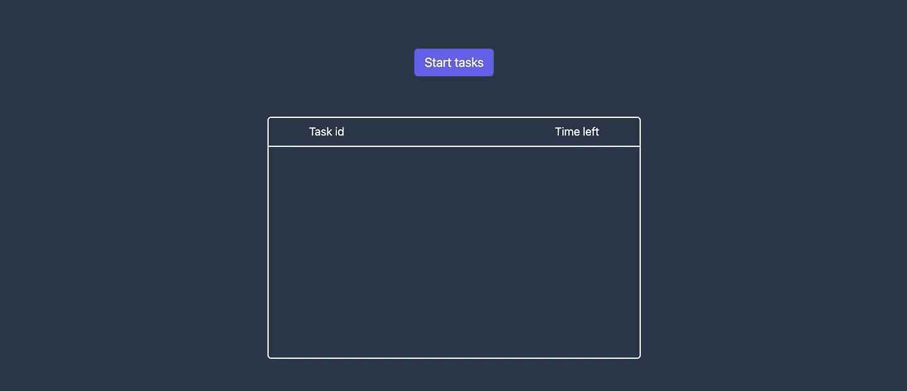
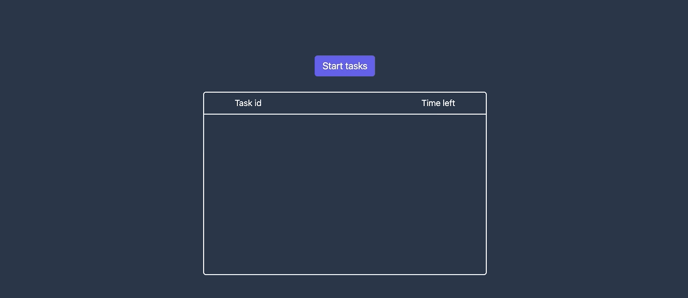

# Queue System

## Multiprocessing



## Multithreading



### How to run locally

- clone the repo
- ```
  $ cd api
  $ pip install -r requirements.txt
  $ python app.py
  ```
- install and start redis on your machine
- open another terminal window and run
  - `$ celery -A app.celery worker -c 16` to use multiprocessing
  - `$ celery -A app.celery worker -P eventlet -c 16` to use multithreading
